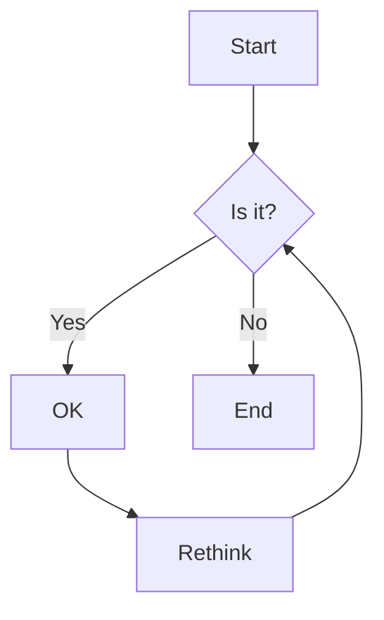
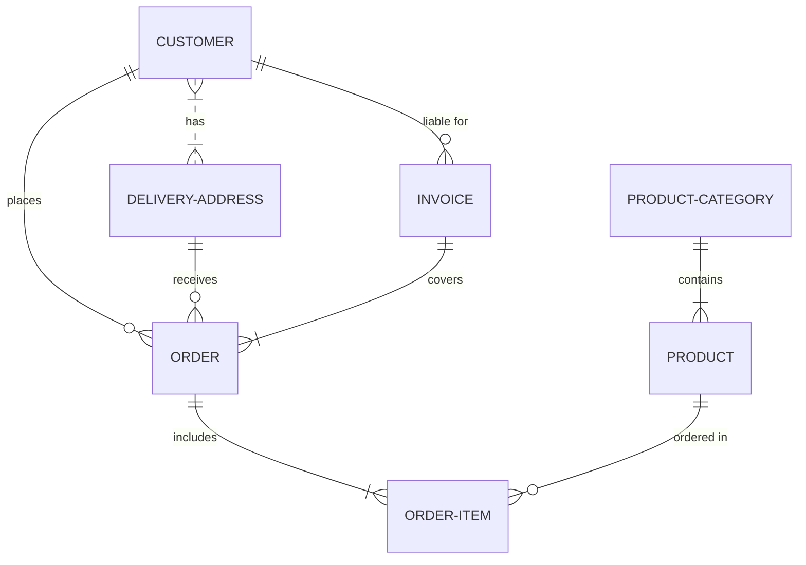
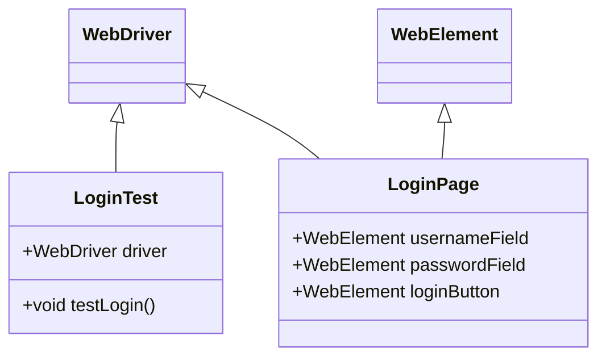
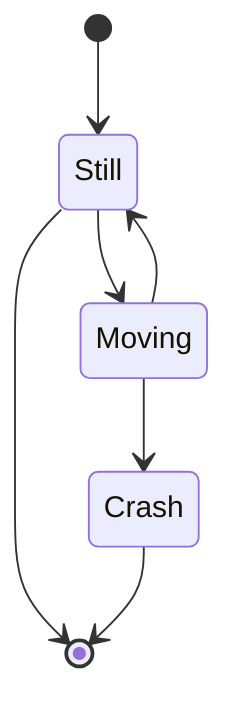

This page exercises the mermaid article-body shortcode and the fenced `mermaid` code block — two authoring paths that produce the same rendered diagram. Both paths emit a `pre.mermaid` element; the Mermaid runtime auto-renders all such blocks at DOMContentLoaded.

The shortcode path is useful inside blockquotes, list items, or other Markdown containers where a fenced block would break the surrounding syntax.

## Flowchart

### Fenced code block path

The canonical Markdown authoring shape.

### Paired shortcode path

flowchart TD
    A[Start] --> B{Is it?}
    B -- Yes --> C[OK]
    C --> D[Rethink]
    D --> B
    B -- No --> E[End]


## Entity Relationship Diagram

### Fenced code block path

### Paired shortcode path

erDiagram
    CUSTOMER }|..|{ DELIVERY-ADDRESS : has
    CUSTOMER ||--o{ ORDER : places
    CUSTOMER ||--o{ INVOICE : "liable for"
    DELIVERY-ADDRESS ||--o{ ORDER : receives
    INVOICE ||--|{ ORDER : covers
    ORDER ||--|{ ORDER-ITEM : includes
    PRODUCT-CATEGORY ||--|{ PRODUCT : contains
    PRODUCT ||--o{ ORDER-ITEM : "ordered in"


## Class Diagram

### Fenced code block path

### Paired shortcode path

classDiagram
    class WebDriver {}
    class WebElement {}
    class LoginPage {
        +WebElement usernameField
        +WebElement passwordField
        +WebElement loginButton
    }
    class LoginTest {
        +WebDriver driver
        +void testLogin()
    }
    WebDriver <|-- LoginTest
    WebElement <|-- LoginPage
    WebDriver <|-- LoginPage


## State Diagram

### Fenced code block path

### Paired shortcode path

stateDiagram-v2
    [*] --> Still
    Still --> [*]
    Still --> Moving
    Moving --> Still
    Moving --> Crash
    Crash --> [*]

