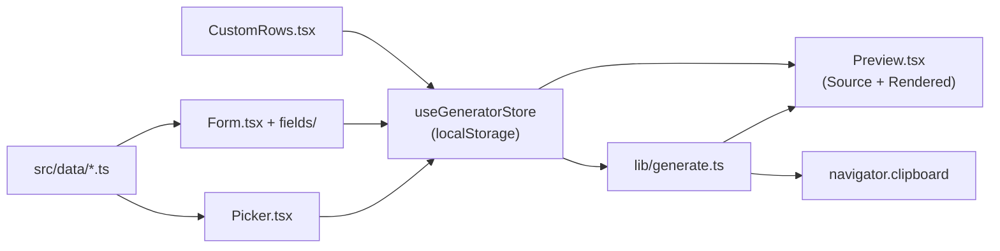

# Shortcodes Generator v2

A React + Vite + TypeScript rewrite of the local shortcode generator. Pick a
shortcode, fill the form fields, and copy the generated Hugo shortcode to your
clipboard. Includes a freeform custom-rows builder for infobox composition.

```
+----------------------+----------------------------+----------------------+
| Picker               | Form                       | Preview              |
| [search box         ]| [field widgets rendered    | [Source | Rendered   |
| - Biography         ]|  from TypeScript specs]    |  tabs]               |
|   * Person          | Name       [Ada Lovelace ] |  |
| - ...               | Notable wk [md textarea   ] |                      |
|                      |                            | [Copy to clipboard  ]|
| [primitives tab]     | [Custom rows section]     |                      |
+----------------------+----------------------------+----------------------+
```

## Prerequisites

- Node.js 26.4.0+ (already required by the repo)
- A modern browser with `navigator.clipboard` support (Chrome, Firefox, Safari,
  Edge — all current versions qualify)

## Quickstart

From the repo root:

```sh
npm run tools:shortcodes:v2
```

The command prints the URL — open it in your browser:

```
Shortcodes generator v2 — http://localhost:5173/
```

Press `Ctrl-C` in the terminal to stop the server.

Additional scripts:

```sh
npm run tools:shortcodes:v2:build  # production build (output to dist/)
npm run tools:shortcodes:v2:check  # sync lint: src/data slugs ↔ layouts/_shortcodes/
```

## What it does

The tool covers 40 shortcodes across two categories:

- **10 inner primitives** (`infobox`, `infobox-row`, `infobox-row-full`,
  `infobox-row-image`, `infobox-image`, `infobox-subheader`, `infobox-section`,
  `infobox-below`, `infobox-subheader`, `row`) — the composable building blocks
  for infobox layouts.
- **30 named wrappers** (`person`, `film`, `settlement`, `country`, `university`,
  `software`, and 24 more) — Wikipedia `Template:Infobox <topic>` wrappers
  mapping those topic types.

For each shortcode the tool:

1. Renders a typed form whose fields are declared in `src/data/`.
2. Live-renders the Hugo shortcode as you type, with a Source / Rendered tab
   toggle.
3. Exposes a **Custom rows** section (for infobox-composition specs) where you
   can add, remove, and reorder arbitrary label+value rows and key=value
   params beyond the predefined fields.
4. Copies the paired-form shortcode to your clipboard on demand.
5. Auto-saves your in-progress form to `localStorage` under a `vhskin:scg:v2`
   namespace so a page refresh does not lose what you typed.

## Architecture

Three layers, each isolated per the project's `00-core.mdc` one-concern rule:

```
+----------------------------------------------------------+
| src/data/*.ts                                             | Schema (one file per shortcode)
|   - slug, category, title, description, fields[]          | - field list with per-field type
|   - upstream, paired, allowCustomRows                       | - compiled-in, no runtime fetch
+---------------------------+-------------------------------+
                            v
+----------------------------------------------------------+
| src/state/ (Zustand)  ←→  src/components/                | Behavior (React, Vite-bundled)
|   - useGeneratorStore   →  Picker / Form / CustomRows     | - reads specs directly
|   - localStorage sync   →  Preview / ThemeToggle         | - watches store, re-renders
+---------------------------+-------------------------------+
                            v
+----------------------------------------------------------+
| index.html + src/styles/                                  | Presentation (mirrored Vector 2022)
|   - tokens.css (hand-mirrored design tokens)              | - three-pane CSS grid
|   - app.css (component styles)                            | - source / rendered tabs
+----------------------------------------------------------+
```

### Data flow



### File layout

```
tools/shortcodes-generator-v2/
├── README.md
├── LICENSE                     # GPL-2.0-or-later
├── index.html                  # Vite entry point
├── vite.config.ts
├── tsconfig.json
├── check-sync.mjs              # src/data ↔ layouts/_shortcodes/ lint
├── package.json
└── src/
    ├── main.tsx                # React root
    ├── App.tsx                 # three-pane shell
    ├── data/
    │   ├── index.ts            # aggregates all specs, re-exports
    │   ├── types.ts            # ShortcodeSpec, FieldSpec, FieldType
    │   ├── primitives/         # 10 inner-primitive specs
    │   │   ├── infobox.ts
    │   │   ├── infobox-row.ts
    │   │   ├── infobox-row-full.ts
    │   │   ├── infobox-row-image.ts
    │   │   ├── infobox-image.ts
    │   │   ├── infobox-subheader.ts
    │   │   ├── infobox-section.ts
    │   │   ├── infobox-below.ts
    │   │   ├── infobox-subheader.ts
    │   │   └── row.ts
    │   └── named/             # 30 named-wrapper specs
    │       ├── person.ts
    │       ├── settlement.ts
    │       ├── film.ts
    │       └── ... (27 more)
    ├── state/
    │   ├── useGeneratorStore.ts
    │   └── storage.ts          # try/catch localStorage wrapper
    ├── components/
    │   ├── Picker.tsx          # search + category groups
    │   ├── Form.tsx            # renders fields for selected spec
    │   ├── CustomRows.tsx      # freeform row/param builder
    │   ├── Preview.tsx         # Source / Rendered tabs + copy
    │   ├── ThemeToggle.tsx     # light / dark / auto
    │   └── fields/             # one component per FieldType
    │       ├── TextField.tsx
    │       ├── TextareaField.tsx
    │       ├── MarkdownField.tsx
    │       ├── SelectField.tsx
    │       ├── CheckboxField.tsx
    │       ├── DateField.tsx
    │       ├── NumberField.tsx
    │       ├── ListField.tsx
    │       └── ImageField.tsx
    ├── lib/
    │   ├── generate.ts         # spec + values → shortcode string
    │   ├── format.ts           # vertical vs compact formatting
    │   └── renderHtml.ts       # mini infobox DOM renderer
    └── styles/
        ├── tokens.css          # Vector 2022 design tokens (hand-mirrored)
        └── app.css             # three-pane grid + component styles
```

## Adding a new shortcode

When a new named wrapper ships under `layouts/_shortcodes/<slug>.html`,
add a matching spec in the same commit:

1. **Add the layout file** under `layouts/_shortcodes/<slug>.html` (flat file
   convention). Document its parameters in a Hugo comment header — that header
   is the source of truth for the field list.

2. **Create the spec** at `src/data/named/<slug>.ts` (or `primitives/`):

```ts
import type { ShortcodeSpec } from './types';

export const slug: ShortcodeSpec = {
  slug: 'my-shortcode',          // must match the layout filename
  category: 'biography',         // picker group
  title: 'My Shortcode',
  description: 'What this shortcode renders.',
  paired: true,
  upstream: 'https://en.wikipedia.org/wiki/Template:Infobox_my_shortcode',
  allowCustomRows: true,         // omit for non-infobox types
  fields: [
    { key: 'name',  label: 'Name',        type: 'text',     required: true },
    { key: 'birth', label: 'Birth date',  type: 'date'               },
    { key: 'bio',   label: 'Biography',   type: 'markdown'            },
  ],
};
```

3. **Wire it in** `src/data/index.ts` — import and push onto the `SHORTCODES`
   array.

4. **Run the sync lint** to verify the layout file exists:

```sh
npm run tools:shortcodes:v2:check
```

Exit code 0 = in sync. Non-zero = slug mismatch or missing layout.

## Custom rows guide

The **Custom rows** section appears for any spec with `allowCustomRows: true`
(infobox-composition shortcodes). It has two sub-panels:

**Custom rows** — add, remove, and drag-to-reorder arbitrary label+value
pairs. Each row renders as a nested `…`
inside the outer shortcode's paired body. Useful for parameters the predefined
fields do not cover.

**Custom params** — add arbitrary `key = value` attributes directly onto the
outer shortcode tag. Useful for template params that the spec has not yet been
updated to include.

Both sub-panels are optional; leave them empty if only the predefined fields
are needed.

## Limitations

- **Local-only.** The Vite dev server binds to `localhost`; not reachable from
  other machines.
- **No Hugo call.** The rendered preview is a JS re-implementation of the
  infobox CSS hooks; it mirrors Hugo's output but is not a Hugo build.
- **Clipboard requires HTTPS or localhost.** `navigator.clipboard.writeText`
  works on `http://localhost:5173`; if you front the server with a remote
  tunnel, the copy button will need HTTPS.
- **localStorage is per-browser.** Switching browsers loses drafts; clearing
  site data loses drafts.
- **Dev tooling only.** React and Vite are devDependencies; they are bundled
  into the dev server's output and are never shipped to `public/`.

## Troubleshooting

- **Port 5173 already in use** — another Vite process is running. Find it with
  `lsof -i :5173` and stop it, or set `PORT=5174` before the command.
- **`file://` blank page** — the dev server must be running; open the printed
  `http://localhost:5173/` URL, do not double-click `index.html`.
- **Type errors after adding a spec** — run `npm run tools:shortcodes:v2:check`
  to verify the slug matches a layout file. Also confirm the spec is imported
  and pushed into the `SHORTCODES` array in `src/data/index.ts`.
- **A field is missing from the form** — the spec's `fields` array is
  incomplete. Add the field to `src/data/named/<slug>.ts` in the same commit
  you extend the underlying layout.

## License

GPL-2.0-or-later. See `tools/shortcodes-generator-v2/LICENSE`. This tool is
not affiliated with the Wikimedia Foundation.
