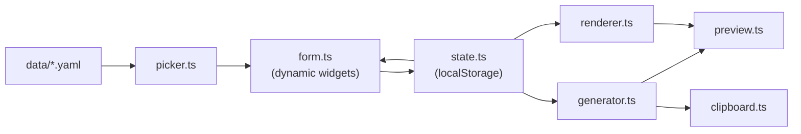

# Shortcodes Generator

A local-only webUI that generates filled-in infobox shortcodes for this Hugo
theme. Pick a shortcode from the left pane, fill the form fields in the middle,
and the right pane shows the generated markdown in both source and rendered
form. One click copies the paired-form shortcode to the clipboard.

```
+----------------------+----------------------------+----------------------+
| Picker (search +     |  Form (dynamic widgets     |  Preview (Source +   |
| category groups)     |  rendered from YAML)       |  Rendered tabs +     |
|                      |                            |  Copy button)        |
|  [ search box ]      |  Name        [Ada Lovelace]|                      |
|  - Biography         |  Birth date  [1815-12-10] |    |
|  - Media             |                            |                      |
|  - ...               |  [ Format: vertical | cpt ]|  [ Copy to clipboard]|
+----------------------+----------------------------+----------------------+
```

## Prerequisites

- Node.js 26.4.0+ (already required by the repo)
- A modern browser with `navigator.clipboard` support (Chrome, Firefox, Safari,
  Edge — all current versions qualify)

## Quickstart

From the repo root:

```sh
npm run tools:shortcodes
```

The command prints a URL — open it in your browser:

```
Shortcodes generator — http://localhost:8731/
```

Press `Ctrl-C` in the terminal to stop the server.

## What it does

For each of the 30 named infobox shortcodes (``, ``,
``, …) plus the 12 inner primitives (``,
``, ``, …), the tool:

1. Renders a form whose fields are defined in `data/<slug>.yaml`.
2. Pre-fills the form with the `defaults` block from the same YAML so authors
   see a worked example before they start typing.
3. Live-renders the corresponding Hugo shortcode as you type, with a toggle
   between vertical-aligned (multi-line) and compact (one-line) formatting.
4. Shows a rendered preview that mirrors what Hugo emits (same infobox CSS
   hooks: `infobox`, `infobox-header`, `infobox-row`, `infobox-label`,
   `infobox-data`, `infobox-section-header`, `infobox-below`).
5. Copies the paired-form shortcode to your clipboard when you click Copy.
6. Auto-saves your in-progress form to `localStorage` per shortcode, so a
   page refresh doesn't lose what you typed.

## Architecture

Three layers, each isolated per the project's `00-core.mdc` one-concern rule:

```
+---------------------------------------------------+
| data/<slug>.yaml                                  |  Schema (one file per shortcode)
|   - slug, category, title, description            |  - field list with per-field widget type
|   - fields: [{ key, label, type, ... }]           |  - defaults block with placeholder values
|   - defaults: { field: value, ... }               |
+---------------------+-----------------------------+
                      v
+---------------------------------------------------+
| scripts/                                           |  Behavior (vanilla TS, no bundler)
|   state.ts  ←→  picker.ts / form.ts / widgets/*    |  - reads YAML via fetch
|   generator.ts  →  preview.ts / renderer.ts        |  - watches state, re-renders form + preview
|   primitives.ts (inner-primitives view)            |  - copies via navigator.clipboard
|   clipboard.ts                                     |  - syncs to localStorage on each change
+---------------------+-----------------------------+
                      v
+---------------------------------------------------+
| index.html + styles/*.css                          |  Presentation (mirrored Vector 2022 tokens)
|   tokens.css (hand-mirrored from                   |  - three-pane CSS grid
|     assets/css/base/_tokens.scss — no import)      |  - source / rendered tabs in preview pane
|   shell.css + pane-specific CSS                    |
+---------------------------------------------------+
```

### Data flow



### File layout

```
tools/shortcodes-generator/
├── README.md
├── LICENSE
├── index.html
├── dev-server.mjs          # static file server on :8731
├── check-sync.mjs          # lint: YAML files ↔ layouts/_shortcodes/
├── styles/
│   ├── tokens.css          # mirrored Vector 2022 design tokens
│   ├── base.css            # reset + typography
│   ├── shell.css           # three-pane grid
│   ├── picker.css
│   ├── form.css
│   └── preview.css
├── scripts/
│   ├── main.ts             # entrypoint
│   ├── state.ts
│   ├── picker.ts
│   ├── form.ts
│   ├── generator.ts
│   ├── primitives.ts       # inner-primitive view
│   ├── preview.ts
│   ├── renderer.ts         # mini infobox re-implementation
│   ├── clipboard.ts
│   ├── yaml.ts             # tiny YAML loader
│   └── widgets/
│       ├── text.ts
│       ├── textarea.ts
│       ├── select.ts
│       ├── checkbox.ts
│       ├── date.ts
│       ├── number.ts
│       ├── box.ts
│       ├── markdown.ts
│       └── image.ts
└── data/
    ├── person.yaml
    ├── settlement.yaml
    └── ... (30 named + 12 primitives = 42 files)
```

## Adding a new shortcode

When a new named wrapper ships under `layouts/_shortcodes/<slug>.html`,
add a matching `data/<slug>.yaml` in the same commit. The schema:

```yaml
slug: my-shortcode        # must match the layout filename
category: biography       # picker group; see existing YAMLs for the taxonomy
title: My Shortcode       # shown in the picker
description: >            # one-line description
  What this shortcode renders.
upstream: https://en.wikipedia.org/wiki/Template:Infobox_my_shortcode
worked_example: |
  
fields:
  - key: name
    label: Name
    type: text
    required: true
  - key: birth_date
    label: Birth date
    type: date
  - key: occupation
    label: Occupation
    type: box
  - key: bio
    label: Biography
    type: markdown
defaults:
  name: "Ada Lovelace"
```

Supported `type` values: `text`, `textarea`, `select`, `checkbox`, `date`,
`number`, `box` (one value per line, comma-joined), `markdown` (textarea with
live preview), `image` (file picker → asset-relative path).

Run `npm run tools:check` after adding the YAML — it asserts every YAML has
a matching layout file (and vice versa), so CI catches accidental drift.

## Inner-primitive view

The named wrappers and the inner primitives are presented as two separate
generator views. The inner-primitive view (`primitives.ts`) lets you generate
`infobox-row`, `infobox-section`, `infobox-image`, `infobox-below`,
`infobox-field`, and the seven `infobox-pair-*` primitives — useful when you
need to drop a custom row inside a named wrapper's `.Inner` block.

## Maintenance and linting

`npm run tools:check` reads every `data/*.yaml`, extracts its `slug`, and
asserts a matching file exists under `layouts/_shortcodes/<slug>.html` (or
the folder variant `layouts/_shortcodes/<slug>/<slug>.html`, or under
`layouts/_shortcodes/infobox/<slug>.html` for the inner primitives). It also
walks `layouts/_shortcodes/` and reports any wrapper without a YAML. Exit
code 0 = in sync; non-zero = drift. Wire this into CI in a follow-on PR.

## Limitations

- **Local-only.** The server binds to `127.0.0.1`; not reachable from other
  machines.
- **No Hugo call.** The rendered preview is a JS re-implementation of the
  infobox CSS hooks; it mirrors Hugo's output but is not a Hugo build.
- **Clipboard requires HTTPS or localhost.** `navigator.clipboard.writeText`
  works on `http://localhost:8731`; if you ever front the server with a
  remote tunnel, the copy button will need HTTPS or a manual select-and-copy.
- **localStorage is per-browser.** Switching browsers loses drafts; clearing
  site data loses drafts.

## Troubleshooting

- **Port 8731 already in use** — set `PORT` in the environment or edit
  `dev-server.mjs` (top of the file).
- **`file://` blank page** — the server must be running; open the printed
  `http://localhost:8731/` URL, do not double-click `index.html`.
- **TypeScript type errors** — run `npm run check:ts` from the repo root.
  The tool's TS files extend the repo-wide `tsconfig.json`.
- **A field is missing from the form** — the shortcode's YAML doesn't have
  it. Add the field to `data/<slug>.yaml` in the same commit you would
  extend the underlying layout.

## License

GPL-2.0-or-later for the tool code (matches the theme's skin chrome at
`LICENSE`). See `tools/shortcodes-generator/LICENSE` for the per-shortcode
attribution note. This project is not affiliated with the Wikimedia
Foundation.